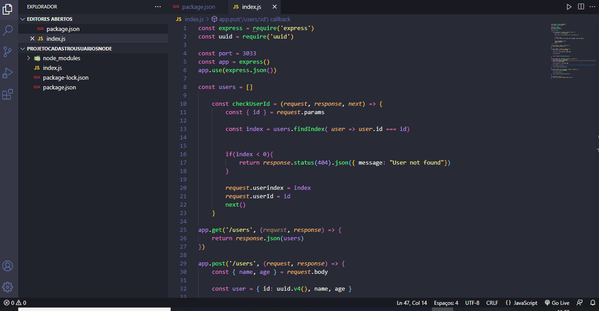

# Cadastro de usuários 👩 - Back-end

> Parte back-end do projeto Cadastro de Usuários realizado com node.js. Conceitos de post, get, put, delete sendo usados. Aqui será salvo os usuários criados no cliente.
### Tecnologias usadas:
 
<a href="https://developer.mozilla.org/pt-BR/docs/Learn/Server-side/Express_Nodejs/Introduction" target="blank">Node</a>;
 
 
##
🤝 Colaboradores
 
<a href="https://www.linkedin.com/in/marcusviniciusbeghelisantos/" target="_blank">Marcus Vinícius</a>

